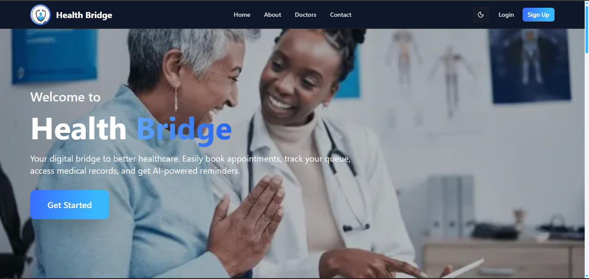

# 🏥 Health Bridge

<div align="center">
  
  
  <h3>Your Digital Bridge to Better Healthcare</h3>
  
  [](https://health-bridge-app-frontendapp.vercel.app/)
  [](LICENSE)
  [](https://nodejs.org/)
  [](https://www.typescriptlang.org/)
</div>

---

## 📸 Application Preview

<div align="center">
  
</div>

---

## 🌟 Overview

**Health Bridge** is a comprehensive digital healthcare platform that revolutionizes the way patients, doctors, and healthcare staff interact. Built with modern web technologies, it provides seamless appointment booking, real-time queue management, AI-powered assistance, and secure medical record management.

### ✨ Key Features

- 🔐 **Multi-Role Authentication** - Secure login for Patients, Doctors, and Staff
- 📅 **Smart Appointment Booking** - Intuitive scheduling with real-time availability
- ⏱️ **Live Queue Management** - Real-time queue updates and position tracking
- 🤖 **AI Healthcare Assistant** - Intelligent chatbot for health queries and support
- 📋 **Digital Medical Records** - Secure storage and management of health records
- 💊 **Prescription Management** - Digital prescriptions and medication tracking
- 🧪 **Lab Results Integration** - Seamless lab result viewing and management
- 📱 **Responsive Design** - Optimized for desktop, tablet, and mobile devices
- 🔔 **Real-time Notifications** - Instant updates via WebSocket connections
- 🌙 **Dark/Light Mode** - User-preferred theme switching

---

## 🚀 Live Demo

**🌐 [Visit Health Bridge Live](https://health-bridge-app-frontendapp.vercel.app/)**

### Demo Credentials
```
Patient Login:
Email: patient@demo.com
Password: demo123

Doctor Login:
Email: doctor@demo.com
Password: demo123

Staff Login:
Email: staff@demo.com
Password: demo123
```

---

## 🛠️ Technology Stack

### Frontend
- **Framework:** Next.js 14 (App Router)
- **Language:** TypeScript
- **Styling:** Tailwind CSS + Shadcn/ui
- **State Management:** React Hooks + Context API
- **Authentication:** JWT + NextAuth.js
- **Real-time:** Socket.IO Client
- **Deployment:** Vercel

### Backend
- **Framework:** NestJS
- **Language:** TypeScript
- **Database:** MongoDB Atlas
- **ODM:** Mongoose
- **Authentication:** JWT + Passport.js
- **Real-time:** Socket.IO
- **Email Service:** Nodemailer
- **Deployment:** Render.com

### Development Tools
- **Monorepo:** Turborepo
- **Testing:** Jest + Playwright
- **Code Quality:** ESLint + Prettier
- **CI/CD:** GitHub Actions
- **Package Manager:** npm

---

## 👥 Team Members

| Name | Role | GitHub |
|------|------|--------|
| **Boaz Marube** | Full Stack Developer | [@boazmarube](https://github.com/boazmarube) |
| **Bereket Eshete** | Full Stack Developer | [@bereketeshete](https://github.com/bereketeshete) |
| **Mahder Hawaz** | Full Stack Developer | [@mahderhawaz](https://github.com/mahderhawaz) |
| **Nuhamin Wondoson** | UI/UX Designer | [@nuhaminwondoson](https://github.com/nuhaminwondoson) |
| **June Kwamboka** | UI/UX Designer | [@junekwamboka](https://github.com/junekwamboka) |
| **Finlay Ndung'u** | UI/UX Designer | [@finlayndungu](https://github.com/finlayndungu) |
| **Sena Kebede** | GenAI Developer | [@senakebede](https://github.com/senakebede) |
| **Solomon** | GenAI Developer | [@solomon](https://github.com/solomon) |

---

## 📁 Project Structure

```
health-bridge-app/
├── 📁 apps/
│   ├── 📁 frontendapp/          # Next.js Frontend Application
│   │   ├── 📁 app/              # App Router Pages & Components
│   │   │   ├── 📁 (auth)/       # Authentication Pages
│   │   │   ├── 📁 (public)/     # Public Pages (About, Contact, etc.)
│   │   │   ├── 📁 components/   # Reusable UI Components
│   │   │   ├── 📁 dashboard/    # Admin Dashboard
│   │   │   ├── 📁 doctor/       # Doctor Portal
│   │   │   ├── 📁 patient/      # Patient Portal
│   │   │   ├── 📁 staff/        # Staff Portal
│   │   │   └── 📁 lib/          # Utilities & Configurations
│   │   └── 📁 public/           # Static Assets
│   └── 📁 backend/              # NestJS Backend API
│       ├── 📁 src/              # Source Code
│       │   ├── 📁 auth/         # Authentication Module
│       │   ├── 📁 appointments/ # Appointment Management
│       │   ├── 📁 doctors/      # Doctor Management
│       │   ├── 📁 patients/     # Patient Management
│       │   ├── 📁 staff/        # Staff Management
│       │   ├── 📁 health-records/ # Medical Records
│       │   ├── 📁 prescriptions/  # Prescription Management
│       │   ├── 📁 lab-results/    # Lab Results
│       │   ├── 📁 notifications/  # Notification System
│       │   ├── 📁 queue/          # Queue Management
│       │   ├── 📁 websocket/      # Real-time Communication
│       │   └── 📁 roles/          # Role-Based Access Control
│       └── 📁 test/             # Test Files
├── 📁 packages/
│   └── 📁 utils/                # Shared Utilities
├── 📁 tests/
│   └── 📁 e2e/                  # End-to-End Tests
├── 📁 .github/
│   └── 📁 workflows/            # CI/CD Pipelines
├── 📄 turbo.json               # Turborepo Configuration
├── 📄 package.json             # Root Package Configuration
└── 📄 README.md                # Project Documentation
```

---

## 🚀 Getting Started

### Prerequisites

Ensure you have the following installed:
- **Node.js** (v18 or higher)
- **npm** (v8 or higher)
- **Git**

### 📥 Installation

1. **Clone the repository:**
   ```bash
   git clone https://github.com/your-username/health-bridge-app.git
   cd health-bridge-app
   ```

2. **Install dependencies:**
   ```bash
   npm install
   ```

3. **Set up environment variables:**
   
   **Frontend (.env.local):**
   ```env
   NEXT_PUBLIC_API_URL=http://localhost:5002
   NEXT_PUBLIC_AI_API_URL=https://health-bridge-app-3.onrender.com
   NEXTAUTH_SECRET=your-nextauth-secret
   NEXTAUTH_URL=http://localhost:3000
   ```
   
   **Backend (.env):**
   ```env
   MONGODB_URI=your-mongodb-connection-string
   JWT_SECRET=your-jwt-secret
   PORT=5002
   NODE_ENV=development
   SMTP_HOST=smtp.gmail.com
   SMTP_PORT=587
   EMAIL_USER=your-email@gmail.com
   EMAIL_PASS=your-app-password
   ```

4. **Start development servers:**
   ```bash
   # Start both frontend and backend
   npm run dev
   
   # Or start individually
   npm run dev:frontend  # Frontend: http://localhost:3000
   npm run dev:backend   # Backend: http://localhost:5002
   ```

---

## 📜 Available Scripts

| Command | Description |
|---------|-------------|
| `npm run dev` | Start both frontend and backend in development mode |
| `npm run dev:frontend` | Start only Next.js frontend |
| `npm run dev:backend` | Start only NestJS backend |
| `npm run build` | Build both applications for production |
| `npm run start` | Start production builds |
| `npm run test` | Run all tests |
| `npm run test:e2e` | Run end-to-end tests |
| `npm run lint` | Lint all code |
| `npm run type-check` | Type check TypeScript code |

---

## 🏗️ Architecture Overview

### Frontend Architecture
- **App Router:** Next.js 14 with file-based routing
- **Component Structure:** Modular, reusable components with Shadcn/ui
- **State Management:** React Context API for global state
- **Authentication:** JWT-based with role-based access control
- **Styling:** Tailwind CSS with custom design system

### Backend Architecture
- **Modular Design:** NestJS modules for each feature domain
- **Database:** MongoDB with Mongoose ODM
- **Authentication:** JWT tokens with Passport.js strategies
- **Real-time:** WebSocket connections for live updates
- **Security:** CORS, rate limiting, input validation

### Database Schema
- **Users:** Patient, Doctor, Staff profiles
- **Appointments:** Scheduling and management
- **Health Records:** Medical history and records
- **Prescriptions:** Digital prescription management
- **Queue:** Real-time queue management
- **Notifications:** System notifications

---

## 🔐 Security Features

- **JWT Authentication:** Secure token-based authentication
- **Role-Based Access Control:** Different permissions for each user type
- **Password Hashing:** bcrypt for secure password storage
- **Input Validation:** Comprehensive data validation
- **Rate Limiting:** API rate limiting to prevent abuse
- **CORS Configuration:** Secure cross-origin resource sharing
- **Environment Variables:** Sensitive data protection

---

## 🧪 Testing

```bash
# Run unit tests
npm run test

# Run e2e tests
npm run test:e2e

# Run tests with coverage
npm run test:coverage
```

---

## 🚀 Deployment

### Frontend (Vercel)
1. Connect your GitHub repository to Vercel
2. Configure environment variables
3. Deploy automatically on push to main branch

### Backend (Render.com)
1. Connect your GitHub repository to Render
2. Configure environment variables
3. Set build and start commands
4. Deploy automatically on push to main branch

---

## 🤝 Contributing

We welcome contributions! Please follow these steps:

1. **Fork the repository**
2. **Create a feature branch:** `git checkout -b feature/amazing-feature`
3. **Commit your changes:** `git commit -m 'Add amazing feature'`
4. **Push to the branch:** `git push origin feature/amazing-feature`
5. **Open a Pull Request**

### Development Guidelines
- Follow TypeScript best practices
- Write tests for new features
- Follow the existing code style
- Update documentation as needed

---

## 📄 License

This project is licensed under the MIT License - see the [LICENSE](LICENSE) file for details.

---

## 📞 Support

If you have any questions or need support, please:
- 📧 Email: support@healthbridge.com
- 🐛 Report issues: [GitHub Issues](https://github.com/your-username/health-bridge-app/issues)
- 💬 Join our community: [Discord](https://discord.gg/healthbridge)

---

## 🙏 Acknowledgments

- Thanks to all team members for their dedication and hard work
- Special thanks to the open-source community for the amazing tools and libraries
- Inspired by the need for better digital healthcare solutions

---

<div align="center">
  <p><strong>Made with ❤️ by the Health Bridge Team</strong></p>
  <p>© 2024 Health Bridge. All rights reserved.</p>
</div>