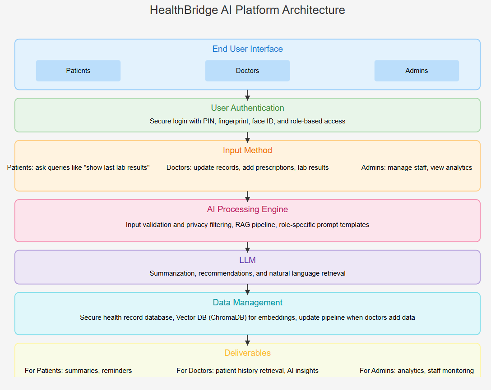

# HealthBridge AI - Medical RAG System with CrewAI

## Overview and Core Concept

A comprehensive medical AI system that combines Retrieval-Augmented Generation (RAG) with CrewAI agents, powered by Gemini LLM, for intelligent medical assistance and clinical decision support.It uses specialized AI agents to automate the process of querying medical knowledge bases and generating informed, evidence-based responses for clinical decision support.

## Overview and Core Concept

The following diagram illustrates the end-to-end flow of the HealthBridge AI platform, from user input to AI-powered response delivery.



## Component Breakdown & Automation Flow

This section details the "what" and "how" of each box in the architecture diagram, explaining the automation that connects them.

### End User Interface & Input Method

What it is: The React frontend application that serves three distinct user roles.

Automation & Functionality:

Role-Based Rendering: The UI automatically adapts its components and available actions based on the authenticated user's role (patient, doctor, admin).

Input Handling: Captures natural language queries and form data, then routes them to the appropriate backend API endpoints via a structured JSON payload.

### User Authentication

What it is: A JWT (JSON Web Token) based authentication service built into the FastAPI backend.

Automation & Functionality:

Secure Login: The /auth/login endpoint (app.post("/auth/login")) validates credentials and automatically generates a time-limited JWT token.

Role-Based Access Control (RBAC): Every subsequent API request includes this token. The get_current_user dependency function automatically decodes the token on every request, validates its signature, and extracts the user_id and role. This user context is then automatically injected into all other endpoints, ensuring users can only access permitted functionalities.

Seamless Context: This automated token validation provides the entire backend with the user's identity and role without any manual checks in the business logic.

### AI Processing Engine

AI Processing Engine (The Core Automation)
What it is: The brain of the operation, primarily implemented in the /ai/chat endpoint (app.post("/ai/chat")). It's not a single monolith but a coordinated sequence of automated steps.

Automation Flow & Functionality:

1. Input Validation & Privacy Filtering: The engine first receives the user's query and their automatically provided context (from the authentication token).

2. Query Analysis & Task Selection: The analyze_query_and_select_task() function automatically analyzes the query's content and the user's role to determine the most appropriate CrewAI task to execute (e.g., symptom_checker_task, treatment_guideline_task). This is done through a weighted keyword matching system.

3. RAG Pipeline Execution: Simultaneously, the engine calls the rag_query_endpoint(). This queries the ChromaDB vector database to find the most semantically similar chunks of text from the medical knowledge base (PDFs). This happens automatically for every user query.

4. Contextual Prompt Building: The system automatically constructs an enhanced prompt for the LLM. This prompt combines:

The user's original query.

The retrieved RAG context (medical evidence).

The user's role and conversation history.

4. Specific instructions tailored to the user's role (e.g., technical language for doctors, simple explanations for patients).
5. CrewAI Task Execution: The pre-configured CrewAI agent for the selected task (e.g., the symptom_checker_agent) is invoked with the enhanced prompt. The agent uses its defined tools and goals to process the information and generate a draft response.

6. Response Formatting: The raw response from the agent is then automatically formatted by format_response_for_role(), which appends role-specific disclaimers and adjusts the tone.

### LLM

What it is: The large language model that generates all natural language responses.

Automation & Functionality: Its operation is fully automated by the AI Processing Engine. It receives the meticulously crafted prompt from step (4) above and generates a coherent, context-aware response. It does not operate on its own but is a crucial part of the automated pipeline.

### Data Management

What it is: The persistence layer, consisting of two databases.

Automation & Functionality:

ChromaDB (Vector Database): Automatically handles vector similarity searches. The scripts/index_real_knowledge.py script is used to automatically ingest, chunk, and embed new medical PDFs into this database.

Secure Health Record Database: (Implied). Patient data queries are automatically filtered by patient_id within the PatientRAGTool to enforce privacy and ensure users only see data they are permitted to access.

###

What it is: The final output delivered to the user.

Automation & Functionality: The UI automatically receives the structured JSON response from the /ai/chat endpoint and renders it appropriately for the user (e.g., displaying a summary for a patient or a detailed clinical insight for a doctor).

## 🏗️ Project Structure

```
healthbridge_genai/
├── src/                          # Core application code
│   └── healthbridge_genai/
│       ├── config/               # Agent and task configurations
│       │   ├── agents.yaml       # CrewAI agent definitions
│       │   └── tasks.yaml        # CrewAI task definitions
│       ├── tools/                # Custom CrewAI + n8n tools
│       │   ├── rag_tool.py       # RAG integration tools
│       │   ├── custom_tool.py    # Template for custom tools
│       │   └── n8n_appointment_tool.py  # n8n workflow integration tool
│       ├── crew.py               # Main CrewAI crew setup
│       └── crew_api.py           # FastAPI API with CrewAI + n8n integration
│
├── rag-system/                   # RAG implementation
│   ├── rag_service.py            # Core RAG service
│   └── knowledge/                # Source knowledge files
│       ├── Medical_book.pdf
│       └── Village_Healthcare_Handbook.pdf
│
├── tests/                        # Test scripts
│   ├── test_gemini_integration.py
│   └── test_real_medical_knowledge.py
│
├── scripts/                      # Utility scripts
│   ├── rag_integration_demo.py
│   └── index_real_knowledge.py
│
├── docs/                         # Documentation
│   ├── RAG_INTEGRATION_GUIDE.md
│   └── gemini_requirements.txt
│
├── real_data/                    # Organized medical data
│   ├── medical_guidelines/
│   └── patient_records/
│
├── real_medical_db/              # ChromaDB with real medical knowledge
├── demo_chroma_db/               # ChromaDB with demo data
├── demo_data/                    # Demo data for testing
├── run_server.py                 # Main server runner (API module selector)
├── n8n_appointment_api.py        # Standalone FastAPI app for n8n booking
├── requirements.txt              # Python dependencies
└── README.md                     # Project documentation


```

## 🚀 Quick Start

### 1. Prerequisites

```bash
# Install dependencies
pip install -r pyproject.toml

# Install Gemini support
pip install langchain-google-genai litellm
```

### 2. Environment Setup

Create a `.env` file:

```
GOOGLE_API_KEY=your_gemini_api_key_here
```

### 3. Index Medical Knowledge

```bash
# Copy your medical PDFs to real_data/medical_guidelines/
# Then run:
python scripts/index_real_knowledge.py
```

### 4. Test the System

```bash
# Test Gemini integration
python tests/test_gemini_integration.py

# Test with real medical knowledge
python tests/test_real_medical_knowledge.py
```

## 🤖 CrewAI Agents

### Medical Agents

- **`medical_history_agent`**: Retrieves and summarizes patient medical records
- **`symptom_checker_agent`**: Analyzes symptoms and provides preliminary assessments
- **`treatment_guideline_agent`**: Provides evidence-based treatment recommendations

### Operational Agents

- **`appointment_scheduler_agent`**: Handles appointment booking and management
- **`queue_monitoring_agent`**: Monitors patient flow and queues
- **`analytics_agent`**: Generates reports and analytics

## 🔧 RAG Tools

### PatientRAGTool

- **Purpose**: Searches patient-specific medical records
- **Security**: Patient ID filtering for data privacy
- **Usage**: Medical history retrieval, medication reviews

### GuidelineRAGTool

- **Purpose**: Searches medical guidelines and protocols
- **Usage**: Treatment recommendations, clinical protocols

### RAGTool (General)

- **Purpose**: Flexible tool for both patient and guideline queries
- **Usage**: Versatile medical information retrieval

## 📊 Key Features

### 🔒 Security & Privacy

- Patient data isolation by ID
- Secure RAG tool access control
- Medical disclaimer integration

### 🧠 AI-Powered

- **Gemini 1.5 Flash** for fast, accurate responses
- **ChromaDB** for efficient vector storage
- **LangChain** for document processing

### 🏥 Medical Focus

- Real medical literature integration
- Clinical decision support
- Emergency procedure protocols

## Installation

Ensure you have Python >=3.10 <3.14 installed on your system. This project uses [UV](https://docs.astral.sh/uv/) for dependency management and package handling, offering a seamless setup and execution experience.

First, if you haven't already, install uv:

```bash
pip install uv
```

Next, navigate to your project directory and install the dependencies:

(Optional) Lock the dependencies and install them by using the CLI command:

```bash
crewai install
```

### Customizing

**Add your `OPENAI_API_KEY` into the `.env` file**

- Modify `src/healthbridge_genai/config/agents.yaml` to define your agents
- Modify `src/healthbridge_genai/config/tasks.yaml` to define your tasks
- Modify `src/healthbridge_genai/crew.py` to add your own logic, tools and specific args
- Modify `src/healthbridge_genai/main.py` to add custom inputs for your agents and tasks

## Running the Project

To kickstart your crew of AI agents and begin task execution, run this from the root folder of your project:

```bash
$ crewai run
```

This command initializes the healthbridge_genai Crew, assembling the agents and assigning them tasks as defined in your configuration.

This example, unmodified, will run the create a `report.md` file with the output of a research on LLMs in the root folder.

## Understanding Your Crew

The healthbridge_genai Crew is composed of multiple AI agents, each with unique roles, goals, and tools. These agents collaborate on a series of tasks, defined in `config/tasks.yaml`, leveraging their collective skills to achieve complex objectives. The `config/agents.yaml` file outlines the capabilities and configurations of each agent in your crew.

## Support

For support, questions, or feedback regarding the HealthbridgeGenai Crew or crewAI.

- Visit our [documentation](https://docs.crewai.com)
- Reach out to us through our [GitHub repository](https://github.com/joaomdmoura/crewai)
- [Join our Discord](https://discord.com/invite/X4JWnZnxPb)
- [Chat with our docs](https://chatg.pt/DWjSBZn)

Let's create wonders together with the power and simplicity of crewAI.
